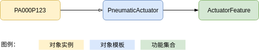

supOS平台提供了对象模板、功能集合、对象实例等模型，用于对企业里的数据进行建模。

* **对象实例**：可以是一个具体的设备，也可以是一个业务流程的模型；它们均具有属性和业务逻辑（服务、事件和订阅）。在supOS平台中所有的对象实例均基于对象模板。一个对象实例只能继承一个对象模板。
* **对象模板**：是对一批具有相同属性和业务逻辑的对象实例的抽象。利用对象模块可以快速实例化，而不用再每个实例单独建模。在supOS平台中所有对象实例均衍生至对象模板。对象模板可以继承别的对象模板，但只能继承一个模板。
* **功能集合**：是对一批具有相同业务特性的模型抽象，通过它能够为不同模板或实例添加相同的业务逻辑和属性。在supOS平台中允许对象模板实现一个或多个功能集合。

对象实例、对象模板、功能集合均具有属性、服务、事件和订阅。属性描述的是一个模型的数据，服务用来定义模型的业务逻辑、事件用来定义模型的状态变化，而订阅用来定义对事件的处理逻辑。

以设备管理举例。企业内会有很多设备，比如阀门、泵、压缩机等；即使阀门也可能会分成不同的类型；所有的阀门不仅有运行数据，还有检维修管理。为此企业需要先建立阀门的对象模型。

通过对象实例、对象模板、功能集合可以创建一个复杂的模型。例如一个设备编号为VA00S001的阀门；并建立一个阀门模板以便可以针对所有阀门设备定义统一的属性和业务逻辑；同时定义一个设备模板来设定统一的属性，并实现了检维修管理的功能集合。如下图：

这个实例就具有了几个模板和功能集合上的属性（比如Valve模板中有材质、行程、开度，Assert模板有厂商、型号等属性），并且在其状态发生变化时可能会触发事件，相对应的订阅逻辑就会执行（例如行程超限了）。

当子系统、总成或组件具有不同的生命周期，需要独立跟踪和分析，或者具有可交换选项时，模型可能会变得更为复杂。例如，我们可以通过向 Valve模板添加一个名为“执行机构”的新属性来改进阀门模型。通过将“执行机构”属性类型定义为 Object，您可以将该属性的值设置为某对象实例。

例如，您可以添加一个 ActuatorFeature功能集合、一个 PneumaticActuator或ElectricActuator对象模板。根据给定阀门安装的执行机构，“执行机构”属性值将为相应执行机构对象实例的名称。例如下图：

通过这样的建模可以将阀门和执行机构分别管理，当某个阀门的执行机构需要更换时只需要调整某个阀门对象实例里“执行机构”属性的值，挑选一个新的执行机构实例即可。